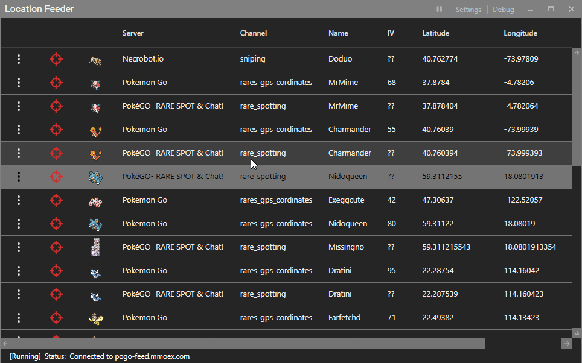

# PogoLocationFeeder
Json feed of pokemon location data for sniper bots like [NecroBot](https://github.com/NECROBOTIO/NecroBot)

We have been contacted by Discord regarding server load issues. They will be blocking old bot accounts, and new feed requests have been migrated to a centralized server to allow for better traffic control. We will be opening up donations toward hosting a dedicated server, aimed at providing correct feed outputs for pokemon moves, IVs, and expiration dates.

## Donations

Bitcoin Donations: <b>1FeederpUZXQN6F45M5cpYuYP6MzE2huPp</b>
<h6><em>[ All Donations will be invested in a server with live poke checks to feed you 100% accurate pokemon informations directly to your bot. So you won't need to run this binary ]</em></h6> 

## Gui

## Downloads
[Download latest Release](https://github.com/5andr0/PogoLocationFeeder/releases/latest "5andr0/PogoLocationFeeder/releases/latest")

## Milestones
- FeroxRev api integration to live check for IV, movesets, expiration time and encounter id to allow snipes without timeconsuming lookups
- Async pokemon lookups for known locations
- Gui settings
- skiplagged checks

## Tutorial
Please use our [wiki](https://github.com/5andr0/PogoLocationFeeder/wiki) page for more info
